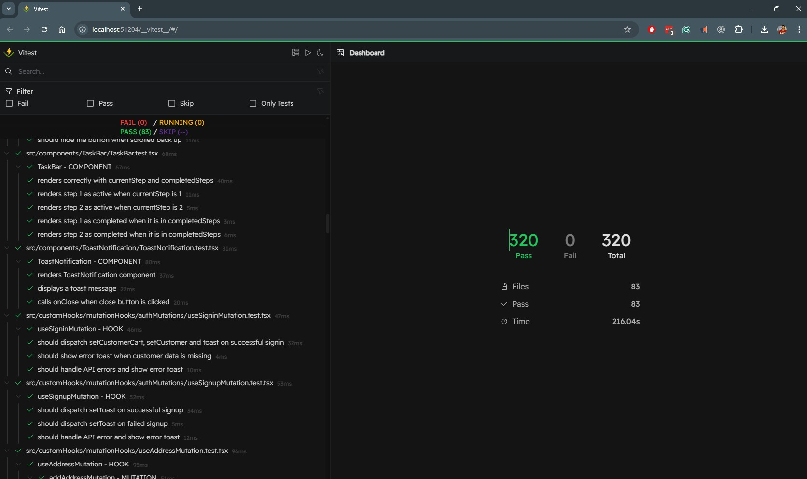
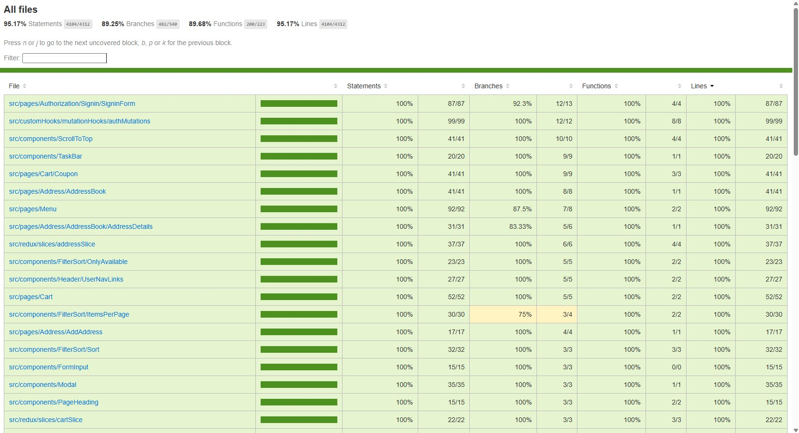

# 🍕 Moje Pizza - Online Pizza Ordering Platform

This repository serves as a portfolio project which showcases my expertise in frontend development with **React**, **TypeScript**, and **Vite**, along with state management using **Redux Toolkit**, data fetching with **React Query**, testing using **Vitest**, and backend integration via **Supabase**.

## Table of Contents

- [Project & Overview](#project-overview)
- [Live Demo](#live-demo)
- [App Screenshots](#app-screenshots)
- [Important Note](#important-note)
- [Features](#features)
- [Tech Stack & Tools](#tech-stack--tools)
- [Project Structure](#project-structure)
- [Code Quality & Best Practices](#code-quality--best-practices)
- [Test Results](#test-results)
- [License](#license)

## Project Overview

**Moje Pizza** is a full-stack pizza ordering web application built with modern web technologies, featuring real-world e-commerce functionality with robust backend integration and comprehensive testing with **91%+ test coverage**.

This project is built using **React, TypeScript, and Vite**, with backend integration powered by **Supabase**. It offers a smooth and intuitive user experience, including user authentication, a shopping cart, an order management system, and advanced filtering features. The project follows best practices with **300+ automated tests** written using **Vitest**, ensuring robustness and reliability.  

## Live Demo

Check out the live demo here: [Moje Pizza Demo](https://moje-pizza.netlify.app)

## App Screenshots


## Important Note

- No **`.env`** file is included in the repository to maintain security.
- Supabase database is pre-configured, so authentication and data fetching will not work in a local environment without proper credentials.

## Features

- **User Authentication**  - Secure `signup`/`signin` using Supabase Email Authentication.
- **Menu Management** - Dynamic pizza menu with filtering, sorting, and pagination
- **Shopping Cart** - Persistent cart functionality with coupon code support
- **Address Book** - CRUD operations for customer addresses with phone validation
- **Order Management** - Order history tracking with sorting (newest/oldest)
- **Checkout System** - Complete order preparation flow (payment integration placeholder)
- **Custom Toast Notifications** - For Success, Errors, and Info messages
- **Lazy Loading & Memoization** - For optimized performance
- **Protected Routes** - Access control for authenticated users
- **300+ Automated Tests** - Ensuring Quality and covering all critical functionalities
- **Fully Responsive Design** - Optimized for all devices

## Tech Stack & Tools

[](https://react.dev/)
[](https://www.typescriptlang.org/)
[](https://tanstack.com/query/latest)
[](https://redux-toolkit.js.org/)
[](https://reactrouter.com/)
[](https://vitest.dev/)
[](https://supabase.com/)

### Frontend

- [React 18.3](https://reactjs.org/) with [TypeScript](https://www.typescriptlang.org/)
- [Vite](https://vitejs.dev/) for build tooling
- [React Router v6](https://reactrouter.com/) for routing
- [Redux Toolkit + React-Redux](https://redux-toolkit.js.org/) for state management
- [React Query v4](https://react-query.tanstack.com/) for data fetching
- [React Hook Form](https://react-hook-form.com/) for form management

### Testing

- [Vitest](https://vitest.dev/) for unit and integration testing
- [@testing-library/react](https://testing-library.com/docs/react-testing-library/intro/) for component testing
- [@testing-library/jest-dom](https://github.com/testing-library/jest-dom) for DOM assertions
- Redux Mock Store for testing Redux Store integration
- Test coverage: Components, Hooks, Redux Slices, Routes, Services, Supabase API's, Utility functions

### Backend Integration

- [Supabase](https://supabase.io/) for backend services and database management (Auth, Database, Storage)
- Supabase JavaScript Client

### UI/UX

- [CSS Modules](https://github.com/css-modules/css-modules) for scoped styling
- Responsive Layouts
- React Icons
- Phone Number Validation (libphonenumber-js)

## Project Structure

- The project follows a modular folder structure for scalability and maintainability.
- Each module has dedicated tests to ensure reliability and maintainability.

```bash
├───public
│
└───src
    │   App.test.tsx
    │   App.tsx
    │   index.module.css
    │   main.tsx
    │   vite-env.d.ts
    │
    ├───assets
    │   ├───images
    │   │       ALL IMAGES....
    │   │       
    │   └───mockData
    │           mockAddress.ts
    │           mockCart.ts
    │           OTHER MOCK DATA...
    │
    ├───components
    │   ├───Button
    │   │   │   ContinueButton.module.css
    │   │   │   ContinueButton.test.tsx
    │   │   │   ContinueButton.tsx
    │   │   │
    │   │   ├───FormSubmitButton
    │   │   │       FormSubmitButton.module.css
    │   │   │       FormSubmitButton.test.tsx
    │   │   │       FormSubmitButton.tsx
    │   │   │
    │   │   └───GoogleSignin
    │   │           GoogleSignin.css
    │   │           GoogleSignin.test.tsx
    │   │           GoogleSignin.tsx
    │   │
    │   ├───EmptyPage
    │   │       EmptyPage.module.css
    │   │       EmptyPage.test.tsx
    │   │       EmptyPage.tsx
    │   │
    │   ├───Footer
    │   │       Footer.module.css
    │   │       Footer.test.tsx
    │   │       Footer.tsx
    │   │
    │   ├───ALL OTHER COMPONENTS........
    │
    ├───customHooks
    │   │   useCustomer.test.tsx
    │   │   useCustomer.tsx
    │   │   OTHER HOOKS........
    │   │
    │   └───mutationHooks
    │       │   useAddressMutation.test.tsx
    │       │   useAddressMutation.tsx
    │       │
    │       └───OTHER MUTATION HOOKS........
    │
    ├───layouts
    │   │   AppLayout.module.css
    │   │   AppLayout.test.tsx
    │   │   AppLayout.tsx
    │   │   CustomerLayout.test.tsx
    │   │   CustomerLayout.tsx
    │   │
    │   └───__snapshots__
    │           CustomerLayout.test.tsx.snap
    │
    ├───pages
    │   ├───Address
    │   │   ├───AddAddress
    │   │   │       AddAddress.module.css
    │   │   │       AddAddress.test.tsx
    │   │   │       AddAddress.tsx
    │   │   │
    │   │   ├───AddressBook
    │   │   │   │   AddressBook.module.css
    │   │   │   │   AddressBook.test.tsx
    │   │   │   │   AddressBook.tsx
    │   │   │   │
    │   │   │   ├───AddressDetails
    │   │   │   │       AddressDetails.module.css
    │   │   │   │       AddressDetails.test.tsx
    │   │   │   │       AddressDetails.tsx
    │   │   │   │
    │   │   │   └───AddressItem
    │   │   │           AddressItem.module.css
    │   │   │           AddressItem.test.tsx
    │   │   │           AddressItem.tsx
    │   │   │
    │   │   └───AddressForm
    │   │           AddressForm.module.css
    │   │           AddressForm.test.tsx
    │   │           AddressForm.tsx
    │   │
    │   ├───OTHER PAGES........
    ├───redux
    │   │   store.test.ts
    │   │   store.ts
    │   │
    │   └───slices
    │       ├───addressSlice
    │       │       addressSlice.test.ts
    │       │       addressSlice.ts
    │       │
    │       ├───authSlice
    │       │       authSlice.test.ts
    │       │       authSlice.ts
    │       │
    │       ├───OTHER SLICES........
    ├───routes
    │       AppRoute.test.tsx
    │       AppRoute.tsx
    │       CustomerRoutes.test.tsx
    │       CustomerRoutes.tsx
    │       ProtectedRoute.test.tsx
    │       ProtectedRoute.tsx
    │
    ├───services
    │       apiAddress.test.ts
    │       apiAddress.ts
    │       apiAuth.test.ts
    │       apiAuth.ts
    │       apiCart.test.ts
    │       apiCart.ts
    │       OTHER SERVICES........
    │
    └───utils
            calculatePaginatedItems.ts
            helpers.test.ts
            helpers.ts
            supabase.ts
            OTHERS........
```

## Code Quality & Best Practices

- **Scalable Architecture:** Modular folder structure for easy expansion
- **Thoroughly Tested:** 91%+ test coverage
- **Optimized Performance:** Lazy loading, memoization, and efficient state updates
- **Type Safety:** Strong TypeScript integration
- **Clean & Maintainable Code:** Following best practices for React, Redux, and React Query

## Test Results

 

## ⭐ Feedback & Contributions

This repository is for showcasing my code rather than open-source contributions.  I do not accept any contributions like pull requests to this project. However, feedback and suggestions are always welcome!

If you have any thoughts, feel free to reach out.

## License

This repository is provided solely for **evaluation purposes** by potential employers.  
No one is permitted to **use, modify, distribute, or commercialize** the code in this repository **for any purpose**.  

By accessing this repository, you **agree** to these terms.  

See the [LICENSE](./LICENSE.txt) file for more details.
